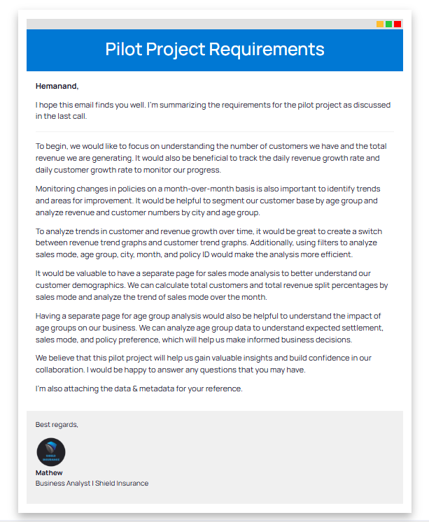
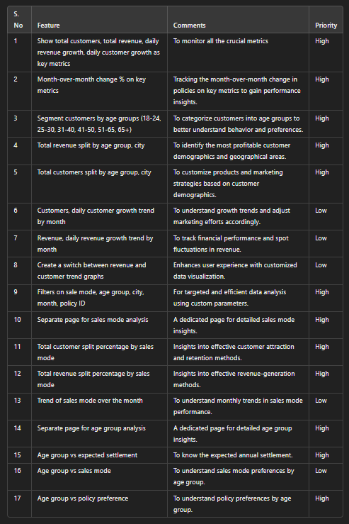
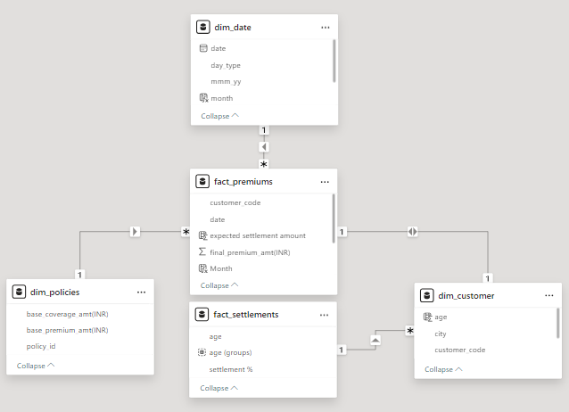
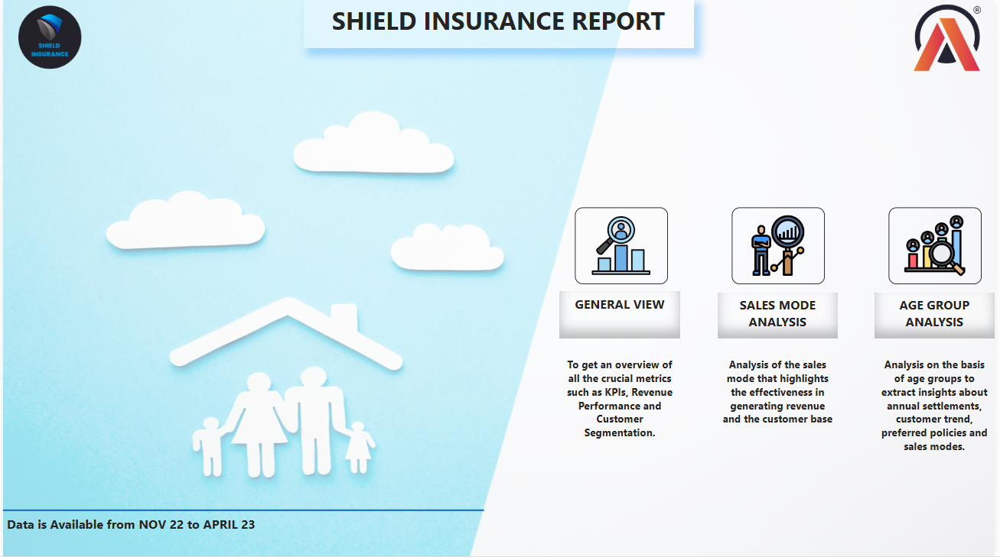
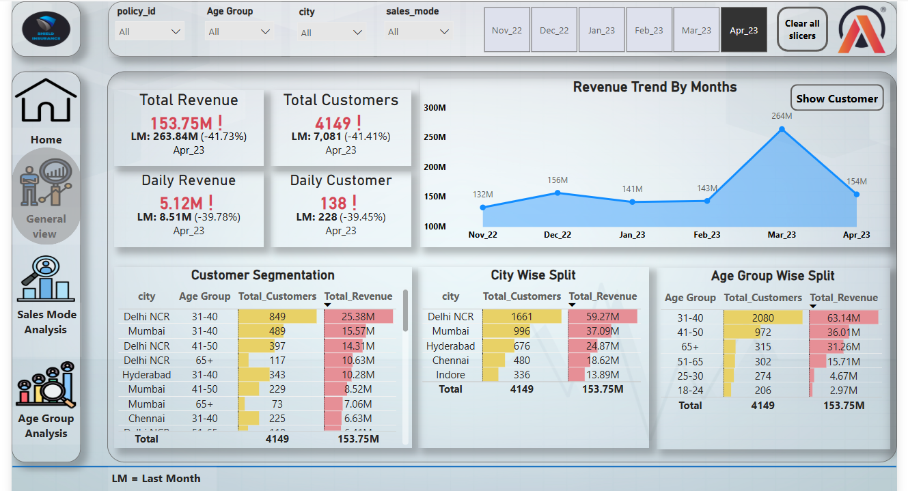
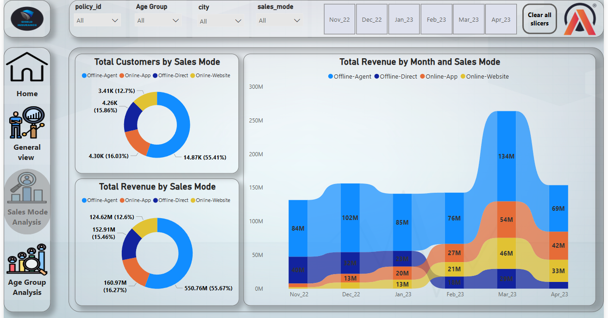
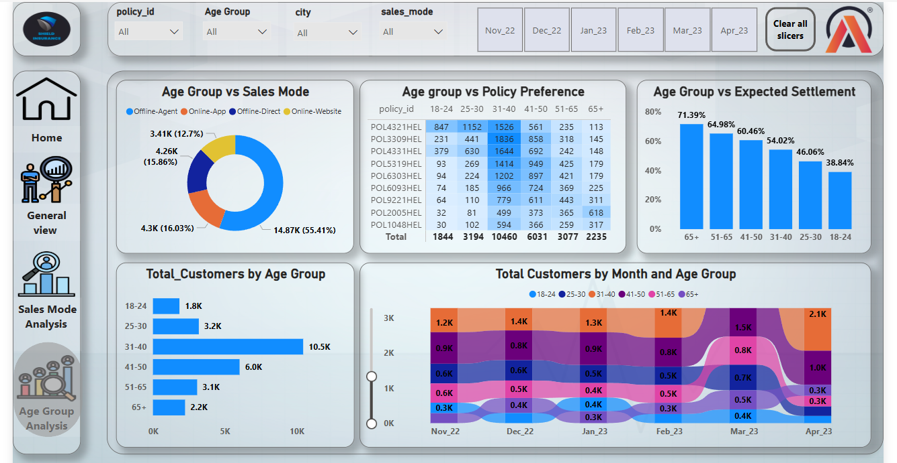

# PowerBI -SHIELD INSURANCE PROJECT

This project is a part of the virtual Internship at AtliQ Technologies.

##  Company Overview:

**Shield Insurance** provides affordable and customizable **insurance policies** for people of all ages. With a strong presence in major cities like **Mumbai, Chennai, Delhi, Hyderabad, and Indore**.
The company makes insurance easily accessible through **offline agents, direct sales, a mobile app, and a website**.

---

## Problem Statement:

**Shield Insurance** wanted to improve decision-making by using data-driven insights. To test how well analytics could support their business goals, they launched a pilot project, taking the first step toward a **long-term partnership** focused on smarter, data-backed strategies. 🚀

---

## Project Requirements and Feature List:

Based on Problem Statement and Client Requirements, I have ceated this below **feature list** and after validation by client i have proceeded to **build dashboard** and i have created **3 different pages** including home page.

  
  

---

## Tools & Technique:

+ Excel
+ Data Cleaning & Preprocessing
+ Power Query (ETL Process)
+ DAX
+ M Language (Advance Query Editor)
+ Power BI Desktop
+ Power BI Service

---

## Data Sets and Data Model:

3 Dimension Tables and 2 Fact tables were provided to me and I worked on a Star Schema 

* Dim_customer
* Dim_date
* Dim_policies

* Fact_premiums
* Fact_settlements

  

---

## Key Metrics:

+ Total Number of Customers
+ Total Revenue
+ Daily Customer Growth
+ Daily Revenue Growth

---

## Live Dashboard Interaction:

To interact with the live dashboard, click here 👉🏻 [Live Dashboard](https://app.powerbi.com/view?r=eyJrIjoiN2RkNmJiNGEtOGVhNS00ZmU5LTk4ZWEtYTMzNzExMDYyYjI1IiwidCI6ImM2ZTU0OWIzLTVmNDUtNDAzMi1hYWU5LWQ0MjQ0ZGM1YjJjNCJ9) 

---

## Dashboard Preview:  

1. **HOME VIEW**:  
   - When a user logs in for the first time, they will land on this page. From here, they can navigate to different pages  
2. **GENERAL VIEW**:  
   - To get an overview of all the crucial metrics such as KPIs, Revenue Performance and Customer Segmentation.
3. **SALES MODE ANALYSIS**:  
   - Analysis of the sales mode that highlights the effectiveness in generating revenue and the customer base
4. **AGE GROUP ANALYSIS**:  
   - Analysis on the basis of age groups to extract insights about annual settlements, customer trend, preferred policies and sales modes. 
  

  
  

  
  

---

## Insights:

- **Highest Revenue:** March 2023 had the most revenue, while November 2022 had the lowest.
- **Top Region:** Delhi NCR generated the highest revenue; Indore had the lowest.
- **Age Group Impact:** Customers aged **31-40** contributed the most revenue.
- **Low Revenue Groups:** **18-30 age group** had the fewest customers and revenue.
- **Top Sales Channel:** **Offline agents** contributed **55.67% of revenue** and **55.41% of customers**.
- **Claims Trend:** Customers aged **65+** had the highest claims, while those aged **18-30** had the lowest.

 ---
 
## Recommendations:

- **Boost Indore’s Sales** with local marketing efforts.
- **Expand Delhi NCR’s Success** by offering plans for younger and older customers.
- **Attract Younger Customers** with affordable, customized policies.
- **Strengthen Online Sales** through better website experience and digital marketing.

---

## Learning Outcomes:  
During this project, I gained hands-on experience in:  

- **Data Cleaning & Preprocessing**: Ensured high-quality data for analysis.  
- **ETL (Extract, Transform, Load) using Power Query**: Processed raw data efficiently.  
- **DAX (Data Analysis Expressions)**: Created powerful calculations for KPIs.  
- **Data Visualization & Dashboard Design**: Built interactive reports in Power BI.  
- **Business Insights Generation**: Identified key trends for better decision-making.  
- **GitHub & Documentation**: Learned how to document and share projects professionally.  

---

## Conclusion:  
This project provided valuable insights into the **insurance industry** and helped me develop advanced **Power BI** and **data analysis skills**. The interactive dashboard enables **better decision-making** for Shield Insurance by identifying revenue trends, customer behaviors, and sales performance.  

🚀 **Thank you for checking out my project!** Feel free to connect with me or provide feedback! 😊  

